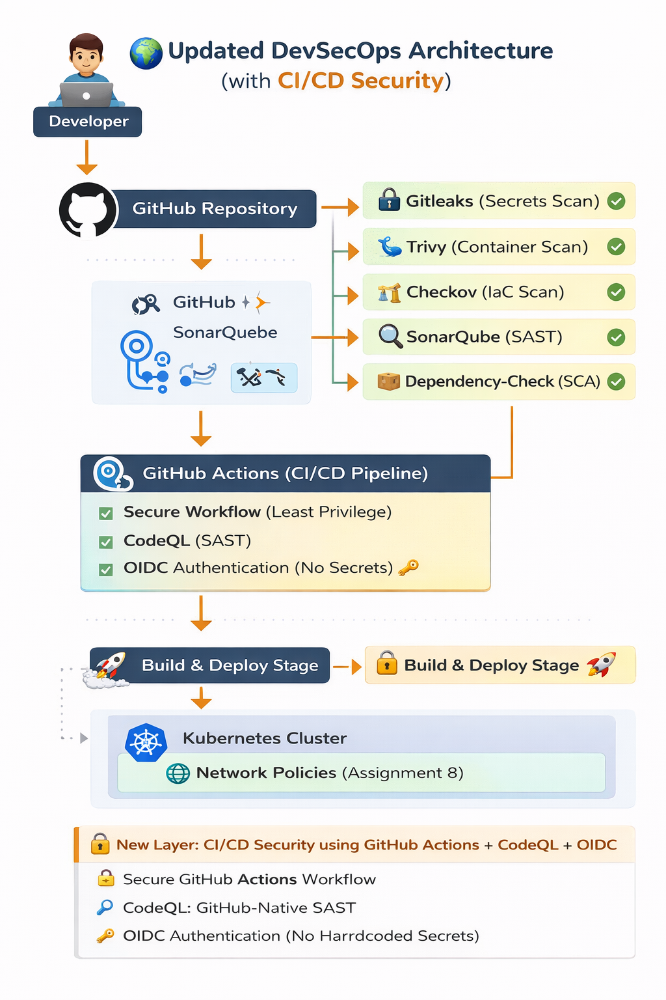

# 🔐 Assignment 11: CI/CD Security - Secure GitHub Actions Workflows

## 🎯 Objective

Implement a secure CI/CD pipeline using GitHub Actions with:

* Secure workflow configuration
* CodeQL for SAST
* OIDC-based authentication (no secrets)

---

## 🛠 Tools Used

* GitHub Actions
* CodeQL
* OIDC (OpenID Connect)

---

## 📁 Project Structure

```
assignment-11-cicd-security/
├── app/
├── docs/
├── reports/
└── README.md
```

---

## ⚙️ Implementation Steps

### 1. Secure Workflow Setup

* Created GitHub Actions workflow
* Used least privilege permissions:

  * `contents: read`

---

### 2. CodeQL Integration (SAST)

* Added CodeQL analysis
* Enabled:

  * `security-events: write`
* Detects vulnerabilities in code automatically

---

### 3. OIDC Authentication

* Enabled:

  * `id-token: write`
* Eliminates need for hardcoded secrets
* Uses short-lived authentication tokens

---

## 🔐 Security Best Practices Implemented

* Least privilege access
* No hardcoded secrets
* Trusted GitHub Actions only
* Automated security scanning (SAST)

---

## ⚠️ Risks Mitigated

* Secret leakage
* Unauthorized access
* Vulnerable code deployment
* Supply chain attacks

---

## 🧠 Interview Questions & Answers

### Q1: What is CI/CD security?

CI/CD security ensures that the software delivery pipeline is protected from vulnerabilities and unauthorized access.

---

### Q2: Why use CodeQL?

CodeQL helps detect security vulnerabilities in code during development using static analysis.

---

### Q3: What is OIDC?

OIDC is a secure authentication method that allows GitHub Actions to access cloud services without storing secrets.

---

### Q4: Why avoid hardcoded secrets?

Hardcoded secrets can be exposed and lead to security breaches.

---

## 🌍 Real-World DevSecOps Insight

Modern DevSecOps pipelines:

* Use OIDC instead of secrets
* Integrate SAST tools like CodeQL
* Enforce least privilege access
* Automate security at every stage

---
## 🏗️ DevSecOps Architecture



## ✅ Conclusion

This assignment demonstrates how to build a secure CI/CD pipeline using GitHub-native tools and modern authentication practices.

