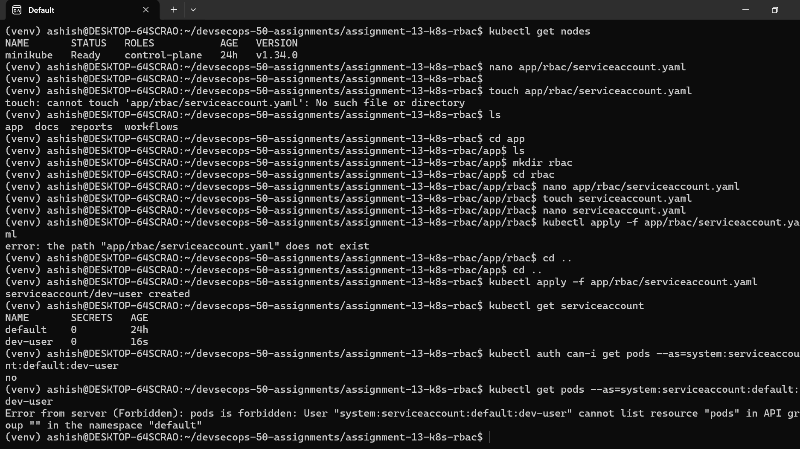
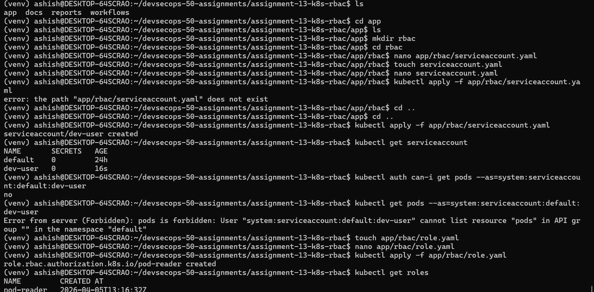

# 🔐 Assignment 13: Kubernetes RBAC Deep Dive

---

## 📌 Overview

This project demonstrates **Identity & Access Management (IAM)** in Kubernetes using **Role-Based Access Control (RBAC)**.

The goal is to enforce:

* Least Privilege Access
* Secure Identity Management
* Unauthorized Access Prevention

---

## 🏗️ Project Structure

```
assignment-13-k8s-rbac/
├── app/
│   └── rbac/
├── docs/
│   ├── README.md
│   └── images/
│       ├── rbac.png
│       └── rbac-created.png
├── reports/
├── workflows/
```

---

## 🚀 Kubernetes Cluster Setup



* Kubernetes cluster initialized using Minikube
* Verified cluster using:

  ```
  kubectl get nodes
  ```

---

## 🔐 RBAC Overview


RBAC components used:

* ServiceAccount → Identity
* Role → Namespace-level permission
* RoleBinding → Assign Role
* ClusterRole → Cluster-level permission
* ClusterRoleBinding → Assign ClusterRole

---

## 🔑 ServiceAccount Creation

```yaml
apiVersion: v1
kind: ServiceAccount
metadata:
  name: dev-user
  namespace: default
```

👉 **Result:**

* Identity created
* No permissions by default (Zero Trust)

---

## ❌ Unauthorized Access (Before RBAC)

```
kubectl get pods --as=system:serviceaccount:default:dev-user
```

👉 **Output:** Forbidden ❌

✔️ Demonstrates default deny model

---

## 🔑 Role Creation (Least Privilege)

```yaml
apiVersion: rbac.authorization.k8s.io/v1
kind: Role
metadata:
  name: pod-reader
  namespace: default
rules:
- apiGroups: [""]
  resources: ["pods"]
  verbs: ["get", "list"]
```

👉 **Result:**

* Read-only access to pods

---

## 🔗 RoleBinding (Access Granted)

```yaml
apiVersion: rbac.authorization.k8s.io/v1
kind: RoleBinding
metadata:
  name: read-pods-binding
  namespace: default
subjects:
- kind: ServiceAccount
  name: dev-user
  namespace: default
roleRef:
  kind: Role
  name: pod-reader
  apiGroup: rbac.authorization.k8s.io
```

👉 **Result:**

* `dev-user` can list pods

---

## 🚫 Restricted Action (Delete Denied)

```
kubectl delete pod nginx-test --as=system:serviceaccount:default:dev-user
```

👉 **Output:** Forbidden ❌

✔️ Enforces least privilege

---

## 🌍 ClusterRole & Cluster Access



```yaml
apiVersion: rbac.authorization.k8s.io/v1
kind: ClusterRole
metadata:
  name: node-reader
rules:
- apiGroups: [""]
  resources: ["nodes"]
  verbs: ["get", "list"]
```

👉 **Result:**

* Cluster-wide read access

---

## 🔗 ClusterRoleBinding

```yaml
apiVersion: rbac.authorization.k8s.io/v1
kind: ClusterRoleBinding
metadata:
  name: node-reader-binding
subjects:
- kind: ServiceAccount
  name: dev-user
  namespace: default
roleRef:
  kind: ClusterRole
  name: node-reader
  apiGroup: rbac.authorization.k8s.io
```

👉 **Result:**

* `dev-user` can read nodes

---

## 🔐 Security Validation

| Action           | Result    |
| ---------------- | --------- |
| Get Pods         | ✅ Allowed |
| List Pods        | ✅ Allowed |
| Delete Pods      | ❌ Denied  |
| Get Nodes        | ✅ Allowed |
| Modify Resources | ❌ Denied  |

---

## 🧠 Key DevSecOps Concepts

* **Least Privilege** → Minimal permissions
* **Zero Trust** → No default access
* **RBAC Enforcement** → Strict policy control
* **Separation of Duties** → Controlled responsibilities

---

## 💼 Real-World Use Cases

* Secure CI/CD pipelines
* Restrict microservices access
* Protect production clusters
* Prevent insider threats

---

## 🎯 Interview Questions

**Q1: What is RBAC?**
Controls access to Kubernetes resources based on roles.

**Q2: Role vs ClusterRole?**

* Role → Namespace
* ClusterRole → Cluster

**Q3: What is RoleBinding?**
Assigns Role to user/service account

**Q4: What is least privilege?**
Only required permissions are granted

**Q5: Default access in Kubernetes?**
❌ No access (secure by default)

---

## 📊 Framework Mapping

### 🔹 NIST

* AC-2 → Account Management
* AC-3 → Access Control
* AC-6 → Least Privilege

### 🔹 CIS Kubernetes Benchmark

* 5.1.3 → Use RBAC
* 5.1.5 → Avoid excessive permissions

### 🔹 OWASP

* A5: Broken Access Control
* A2: Security Misconfiguration

### 🔹 DSOMM

* IAM maturity achieved
* Policy enforcement implemented

---

## 🏆 Outcome

✔️ Secure RBAC implementation
✔️ Unauthorized access prevented
✔️ Production-ready DevSecOps practice
✔️ Interview-ready knowledge

---
