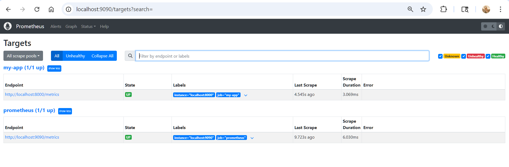
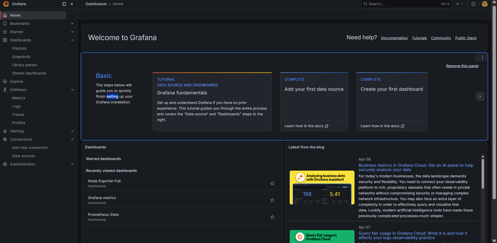
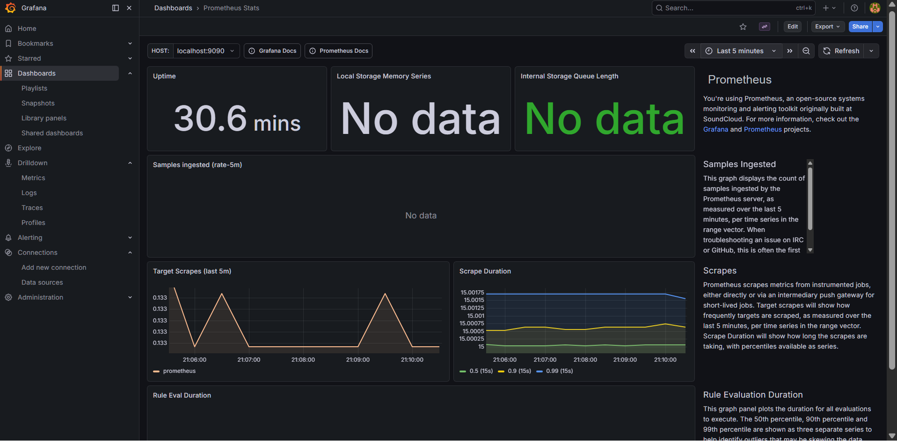
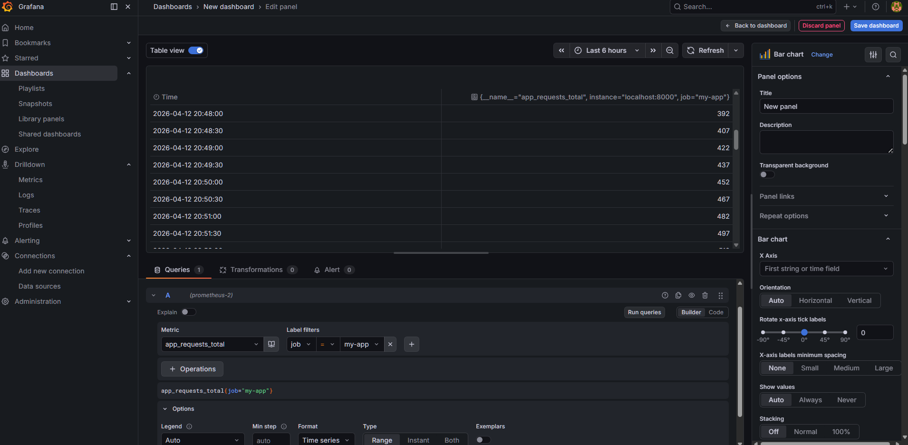
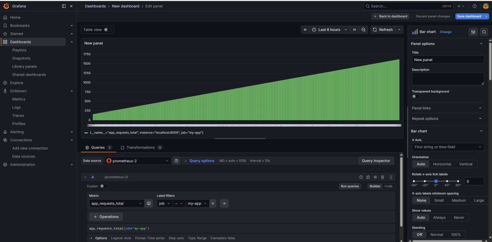

# Assignment 17 - Monitoring

## 📌 Title
Security Monitoring with Prometheus and Grafana

## 🛠 Tools Used
- Prometheus
- Grafana

---

## 📖 Overview

Monitoring helps us observe system performance and detect issues.

In this assignment, we implemented basic monitoring using:
- Prometheus (metrics collection)
- Grafana (dashboard visualization)

---

## ⚙️ Architecture

App → Prometheus → Grafana

---

## 🚀 Implementation Steps

### 1. Create Metrics Application
- Created Python app using `prometheus_client`
- Exposed metrics on `/metrics`

### 2. Setup Prometheus
- Downloaded Prometheus
- Configured `prometheus.yml`
- Added application as target

### 3. Metrics Collection
- Prometheus successfully scraped:
  - `app_requests_total`

### 4. Setup Grafana
- Installed Grafana
- Added Prometheus as data source

### 5. Dashboard Creation
- Created dashboard
- Visualized:
  - `app_requests_total`

---

## 📊 Result

- Metrics successfully collected
- Dashboard shows real-time data
- Monitoring pipeline working

---

## ✅ Conclusion

Successfully implemented basic monitoring using Prometheus and Grafana.
## 📸 Screenshots

### App Metrics

### Prometheus Targets

### Prometheus UI

### Grafana Dashboard

### Grafana Panel

