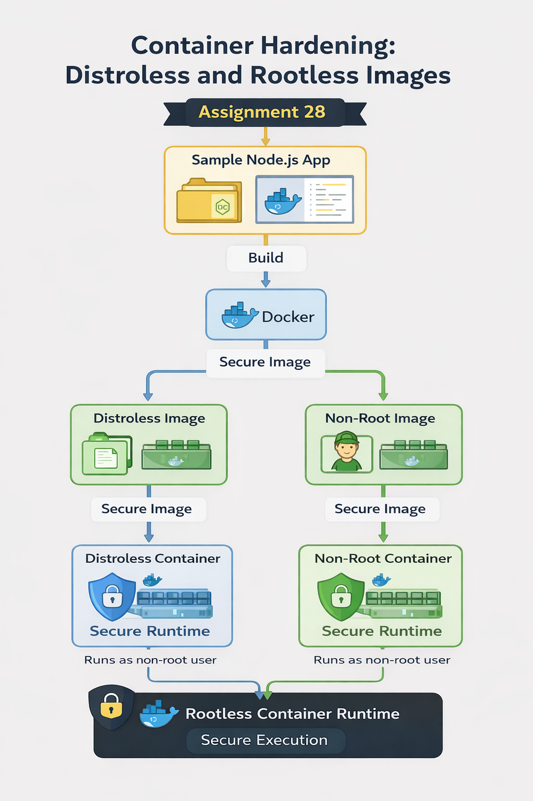

# 🚀 ASSIGNMENT 28 · CONTAINER SECURITY

## Container Hardening with Distroless and Rootless Images

⭐⭐ Intermediate
🛠 Tools: Docker, Distroless, Buildah, Podman

---

## 📌 Objective

Harden container images by using distroless base images and running containers as non-root users.

---

## 🎯 Learning Outcomes

* Understand container security best practices
* Build minimal (distroless) container images
* Run containers as non-root users
* Reduce attack surface of containers
* Compare standard vs hardened images

---

## 🏗️ Architecture Overview

Application → Docker Build → Distroless Image
↓
Rootless Container Runtime → Secure Execution

---

## 🚀 Implementation Steps

### 1️⃣ Create Project Structure

```bash
mkdir -p assignment-28-container-hardening/app
cd assignment-28-container-hardening
```

---

### 2️⃣ Create Sample App

```javascript
const http = require('http');

const server = http.createServer((req, res) => {
  res.end("Hello from Secure Container!");
});

server.listen(3000, () => {
  console.log("Server running on port 3000");
});
```

---

### 3️⃣ Create package.json

```json
{
  "name": "secure-app",
  "version": "1.0.0",
  "main": "server.js",
  "scripts": {
    "start": "node server.js"
  }
}
```

---

### 4️⃣ Standard Dockerfile

```Dockerfile
FROM node:18

WORKDIR /app
COPY app/ .
RUN npm install

EXPOSE 3000
CMD ["node", "server.js"]
```

---

### 5️⃣ Build & Run Standard Container

```bash
docker build -t secure-app:standard .
docker run -d -p 3001:3000 --name standard-container secure-app:standard
```

---

### 6️⃣ Distroless Dockerfile

```Dockerfile
FROM node:18 AS builder

WORKDIR /app
COPY app/ .
RUN npm install

FROM gcr.io/distroless/nodejs18

WORKDIR /app
COPY --from=builder /app .

EXPOSE 3000
CMD ["server.js"]
```

---

### 7️⃣ Build & Run Distroless Container

```bash
docker build -f Dockerfile.distroless -t secure-app:distroless .
docker run -d -p 3002:3000 --name distroless-container secure-app:distroless
```

---

### 8️⃣ Non-Root Dockerfile

```Dockerfile
FROM node:18

WORKDIR /app
COPY app/ .
RUN npm install

RUN useradd -m appuser
USER appuser

EXPOSE 3000
CMD ["node", "server.js"]
```

---

### 9️⃣ Build & Run Non-Root Container

```bash
docker build -f Dockerfile.nonroot -t secure-app:nonroot .
docker run -d -p 3003:3000 --name nonroot-container secure-app:nonroot
```

---

## 🔍 Verification

### Check Running User

```bash
docker exec standard-container whoami     # root
docker exec nonroot-container whoami      # appuser
```

Distroless:

```bash
docker exec distroless-container whoami
# (command not found - expected)
```

---

## 📊 Image Size Comparison

```bash
docker images | grep secure-app
```

| Image Type | Size    |
| ---------- | ------- |
| Standard   | ~1.09GB |
| Non-root   | ~1.09GB |
| Distroless | ~115MB  |

---

## 🔐 Security Improvements

* Removed unnecessary OS packages (Distroless)
* Reduced attack surface drastically
* Eliminated shell access in container
* Avoided running containers as root
* Implemented principle of least privilege

---

## ⚠️ Challenges Faced

* Port conflicts during container run
* Distroless debugging limitations
* Missing shell utilities in minimal images

---

## ✅ Conclusion

Distroless images and non-root execution significantly improve container security by reducing vulnerabilities and enforcing least privilege access.

---

## 🔗 Repository

https://github.com/Ashish420-tech/devsecops-50-assignments.git

