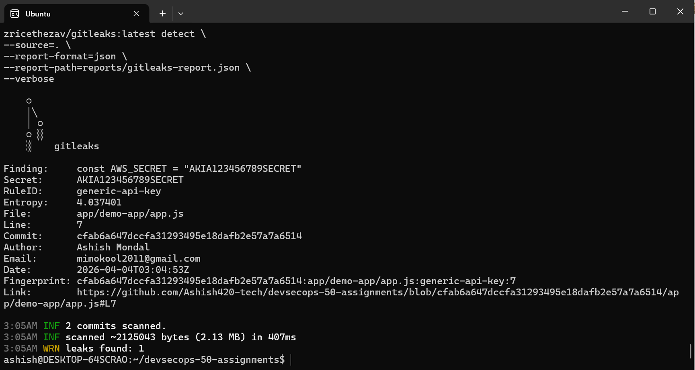

# 🔐 Assignment 01 — Secret Scanning with Gitleaks

## 📌 Objective

Detect and prevent hardcoded secrets (API keys, tokens, passwords) in source code using Gitleaks, and integrate it into a DevSecOps workflow.

---

## 🛠️ Tools Used

* Gitleaks (Secret scanning)
* Docker (Tool execution)
* Git (Version tracking)

---

## 🧪 Step 1: Setup Project

Created a centralized DevSecOps repository structure:

```
devsecops-50-assignments/
├── app/demo-app/
├── security-tools/gitleaks/
├── .github/workflows/
├── reports/
├── docs/
```

---

## 🚨 Step 2: Introduce Vulnerability

Added a hardcoded secret in application code:

```js
const AWS_SECRET = "AKIA123456789SECRET";
```

---

## 🔍 Step 3: Run Gitleaks Scan

Command used:

```bash
docker run --rm \
-v $(pwd):/repo \
-w /repo \
zricethezav/gitleaks:latest detect \
--source=. \
--report-format=json \
--report-path=reports/gitleaks-report.json \
--verbose
```

---

## 📊 Step 4: Scan Results

Gitleaks detected:

* Secret Type: Generic API Key
* File: `app/demo-app/app.js`
* Line: 7
* Commit tracked: Yes

This confirms that secrets are detectable in Git history.

---

## ❗ Root Cause

* Hardcoded credentials in source code
* Secrets committed to Git history

---

## 🔧 Step 5: Remediation

### ✅ Fix Applied

1. Removed hardcoded secret:

```js
// Removed insecure secret
```

2. Used environment variable:

```js
const AWS_SECRET = process.env.AWS_SECRET;
```

3. Created `.env` file:

```
AWS_SECRET=AKIA123456789SECRET
```

4. Prevented commit using `.gitignore`:

```
.env
```

---

## ⚠️ Important Security Insight

Even after removing secrets from code:

* Secrets remain in Git history
* They must be rotated immediately
* Tools like `git filter-repo` or `BFG Repo Cleaner` should be used

---

## 🧠 Interview Questions & Answers

### ❓ What is Gitleaks?

Gitleaks is a secret detection tool that scans source code and Git history for exposed credentials like API keys and tokens.

---

### ❓ Why is secret scanning important?

Exposed secrets can lead to:

* Unauthorized access
* Cloud resource compromise
* Data breaches

---

### ❓ Where do you integrate Gitleaks?

* CI/CD pipelines
* Pull request validation
* Pre-commit hooks

---

### ❓ Why was the secret not detected initially?

Because Gitleaks scans Git commits by default, and the secret was not committed at first.

---

## ✅ Key Learnings

* Always scan code before merging
* Never store secrets in source code
* Use environment variables and secret managers
* Automate detection in CI pipelines

---

## 🚀 Next Step

Integrate Gitleaks into GitHub Actions to:

* Automatically scan on PR
* Fail pipeline on critical leaks
* Upload SARIF results to GitHub Security Dashboard
## 📸 Screenshot — Gitleaks Detection Output


